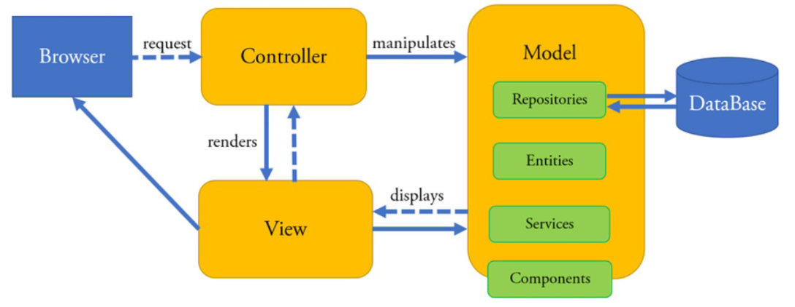

# Notatka

1. .venv
2. django setup
   
   **Utworzenie projektu:**
   
   1. `django-admin startproject ecommerce`
   
   **Uruchomienie serwera:**
   
   1. `cd ecomerce`
   2. `python manage.py runserver`
   3. `python manage.py startapp store`

3. dodajemy w settings.py w INSTALLED_APPS **'store.apps.StoreConfig',**
4. `python ./ecommerce/manage.py createsuperuser`
5. `python ./ecommerce/manage.py makemigrations` i `python ./ecommerce/manage.py migrate`
6. `python ./ecommerce/manage.py runserver admin`
   i odpalamy przeglądarkę w localhost:port/admin
7. `./ecommerce/store` dodajemy folder `templates` i w tym folderze dodajemy folder `store`
   dodajemy pliki html (main, cart, checkout, store)
   do widoku
8. do pliku `./ecommerce/store/views.py` dodajemy
   ```python
   def store(req):
    context = {}
    return render(req, 'store/store.html', context)

   def cart(req):
      context = {}
      return render(req, 'store/cart.html', context)

   def checkout(req):
      context = {}
      return render(req, 'store/checkout.html', context)
   ```
   dodajemy plik `./ecomerce/store/urls.py` z zawartością:
   ```python
   from django.urls import path
   from . import views

   urlpatterns = [
      path('', views.store, name="store"),
      path('cart/', views.cart, name="cart"),
      path('checkout/', views.checkout, name="checkout"),
   ]
   ```
   do pliku `./ecommerce/urls.py` dodajemy
   ```python
   from django.contrib import admin
   from django.urls import path, include

   urlpatterns = [
      path('admin/', admin.site.urls),
      path('', include('store.urls')),
   ]
   ```